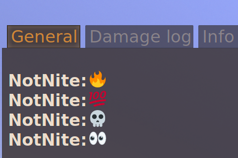

# Chat Emojis

Adds Discord-like emojis into game chat. Use the emoji's shortcode (like `:fire:` or `:flushed:`) to render it in game.

## Credits

- [jdecked/twemoji](https://github.com/jdecked/twemoji/releases/tag/v15.1.0) (CC-BY-4.0)
- Discord's emoji shortcode table (extracted from the Discord client source code)
